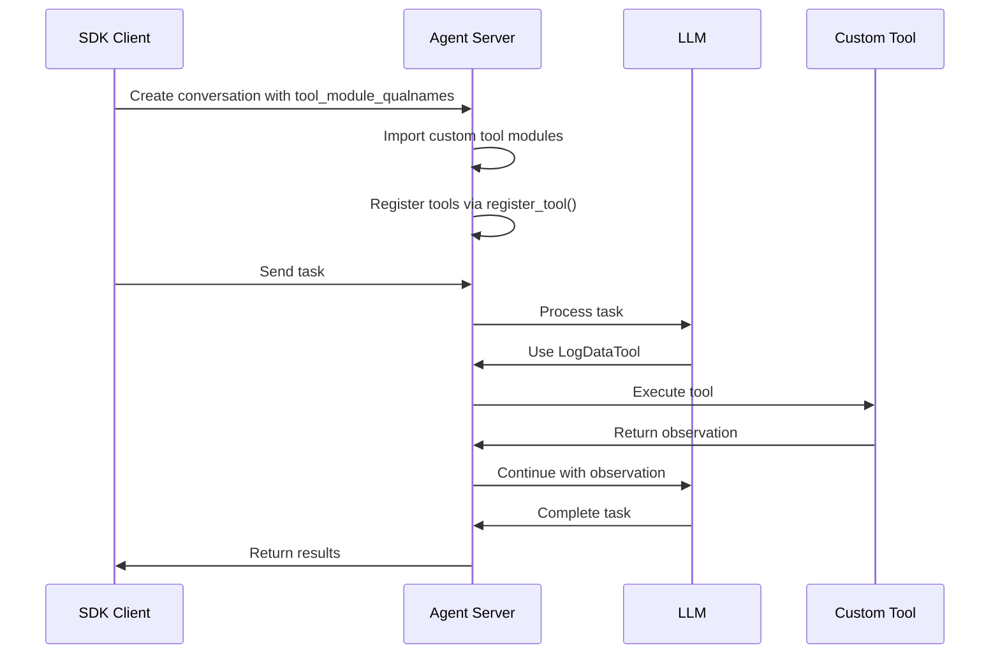

## Overview

When using a [remote agent server](/sdk/guides/agent-server/overview), custom tools must be available in the server's Python environment. This guide shows how to build a custom base image with your tools and use `DockerDevWorkspace` to automatically build the agent server on top of it.

<Note>
For standalone custom tools (without remote agent server), see the [Custom Tools guide](/sdk/guides/custom-tools).
</Note>

## Use Cases

Custom tools with remote agent servers are useful for:

- **Structured data collection**: Define tools like `log_data`, `record_metric`, or `track_event` to collect structured data during agent runs
- **Custom integrations**: Tools that interact with external systems (APIs, databases, etc.)
- **Domain-specific operations**: Business logic tools specific to your application
- **Downstream processing**: Collected data can be used to generate reports, trigger workflows, etc.

## Architecture

```
┌─────────────────┐         ┌──────────────────────────┐
│   SDK Client    │         │   Remote Agent Server    │
│                 │         │   (Built on custom base) │
│  - Define tools │◄────────┤                          │
│  - Send tasks   │   API   │  - Custom tools in       │
│  - Get results  │         │    Python path           │
│                 │         │  - Dynamic registration  │
└─────────────────┘         │  - Tool execution        │
                            │  - JSON file output      │
                            └──────────────────────────┘
```

## Complete Example

<Note>
A complete working example is available on GitHub: [examples/02_remote_agent_server/05_custom_tool/](https://github.com/OpenHands/software-agent-sdk/tree/main/examples/02_remote_agent_server/05_custom_tool)
</Note>

The example includes:
- **Custom tool implementation** (`custom_tools/log_data.py`) - A tool for logging structured data to JSON
- **Dockerfile** - Simple Dockerfile that copies custom tools into a base image
- **Build script** (`build_custom_image.sh`) - Builds the custom base image
- **SDK example** (`custom_tool_example.py`) - Demonstrates the full workflow

## Step-by-Step Guide

### 1. Define Your Custom Tool

Create a Python module for your tool (e.g., `custom_tools/log_data.py`):

```python
"""Log Data Tool - Example custom tool for logging structured data to JSON."""

import json
from collections.abc import Sequence
from datetime import UTC, datetime
from enum import Enum
from pathlib import Path
from typing import Any

from pydantic import Field

from openhands.sdk import (
    Action,
    ImageContent,
    Observation,
    TextContent,
    ToolDefinition,
)
from openhands.sdk.tool import ToolExecutor, register_tool


class LogLevel(str, Enum):
    """Log level for entries."""
    DEBUG = "debug"
    INFO = "info"
    WARNING = "warning"
    ERROR = "error"


class LogDataAction(Action):
    """Action to log structured data to a JSON file."""
    message: str = Field(description="The log message")
    level: LogLevel = Field(
        default=LogLevel.INFO,
        description="Log level (debug, info, warning, error)",
    )
    data: dict[str, Any] = Field(
        default_factory=dict,
        description="Additional structured data to include in the log entry",
    )


class LogDataObservation(Observation):
    """Observation returned after logging data."""
    success: bool = Field(description="Whether the data was successfully logged")
    log_file: str = Field(description="Path to the log file")
    entry_count: int = Field(description="Total number of entries in the log file")

    @property
    def to_llm_content(self) -> Sequence[TextContent | ImageContent]:
        """Convert observation to LLM content."""
        if self.success:
            return [
                TextContent(
                    text=(
                        f"✅ Data logged successfully to {self.log_file}\n"
                        f"Total entries: {self.entry_count}"
                    )
                )
            ]
        return [TextContent(text="❌ Failed to log data")]


# Default log file path
DEFAULT_LOG_FILE = "/tmp/agent_data.json"


class LogDataExecutor(ToolExecutor[LogDataAction, LogDataObservation]):
    """Executor that logs structured data to a JSON file."""

    def __init__(self, log_file: str = DEFAULT_LOG_FILE):
        self.log_file = Path(log_file)

    def __call__(self, action: LogDataAction, conversation=None):
        """Execute the log data action."""
        # Load existing entries or start fresh
        entries: list[dict[str, Any]] = []
        if self.log_file.exists():
            try:
                with open(self.log_file) as f:
                    entries = json.load(f)
            except (json.JSONDecodeError, OSError):
                entries = []

        # Create new entry with timestamp
        entry = {
            "timestamp": datetime.now(UTC).isoformat(),
            "level": action.level.value,
            "message": action.message,
            "data": action.data,
        }
        entries.append(entry)

        # Write back to file
        self.log_file.parent.mkdir(parents=True, exist_ok=True)
        with open(self.log_file, "w") as f:
            json.dump(entries, f, indent=2)

        return LogDataObservation(
            success=True,
            log_file=str(self.log_file),
            entry_count=len(entries),
        )


class LogDataTool(ToolDefinition[LogDataAction, LogDataObservation]):
    """Tool for logging structured data to a JSON file."""

    @classmethod
    def create(cls, conv_state, **params):
        log_file = params.get("log_file", DEFAULT_LOG_FILE)
        executor = LogDataExecutor(log_file=log_file)

        return [
            cls(
                description=(
                    "Log structured data to a JSON file. Use this tool to record "
                    "information, findings, or events during your work. Each log "
                    "entry includes a timestamp and can contain arbitrary structured data."
                ),
                action_type=LogDataAction,
                observation_type=LogDataObservation,
                executor=executor,
            )
        ]


# Auto-register the tool when this module is imported
register_tool("LogDataTool", LogDataTool)
```

### 2. Create a Dockerfile

Create a simple `Dockerfile` that copies your custom tools into a base image:

```dockerfile
# Dockerfile for custom base image with custom tools
#
# This Dockerfile creates a base image that includes custom tools.
# When used with DockerDevWorkspace(base_image=...), the agent server
# will be built on top of this image automatically.

FROM nikolaik/python-nodejs:python3.12-nodejs22

# Copy custom tools into the Python path
COPY custom_tools /app/custom_tools

# Add /app to PYTHONPATH so custom_tools can be imported
ENV PYTHONPATH="/app:${PYTHONPATH}"
```

<Note>
The Dockerfile uses a simple base image (`nikolaik/python-nodejs`). When you use `DockerDevWorkspace` with the `base_image` parameter, it automatically builds the agent server on top of this image.
</Note>

### 3. Create a Build Script

Create a build script (`build_custom_image.sh`):

```bash
#!/bin/bash
set -e

SCRIPT_DIR="$(cd "$(dirname "${BASH_SOURCE[0]}")" && pwd)"
TAG="${1:-custom-base-image:latest}"

echo "🐳 Building custom base image with custom tools..."
echo "🏷️  Tag: $TAG"
echo "📂 Build context: $SCRIPT_DIR"

docker build \
  -t "$TAG" \
  "$SCRIPT_DIR"

echo "✅ Custom base image built successfully!"
echo "🏷️  Image tag: $TAG"
```

Make it executable:
```bash
chmod +x build_custom_image.sh
```

### 4. Build the Custom Base Image

Build your custom base image:

```bash
./build_custom_image.sh custom-base-image:latest
```

### 5. Use the Custom Image in Your SDK Script

Create an SDK script that uses `DockerDevWorkspace` with your custom base image:

```python
import os
from pydantic import SecretStr

from openhands.sdk import (
    LLM,
    Agent,
    Conversation,
    Tool,
)
from openhands.tools.preset.default import get_default_tools, get_default_condenser
from openhands.workspace import DockerDevWorkspace

# Set up LLM
api_key = os.getenv("LLM_API_KEY")
llm = LLM(
    usage_id="agent",
    model="anthropic/claude-sonnet-4-5-20250929",
    api_key=SecretStr(api_key),
)

# Create workspace with custom base image
# DockerDevWorkspace will build the agent server on top of this image
with DockerDevWorkspace(
    base_image="custom-base-image:latest",
    host_port=8010,
) as workspace:
    # Import custom tools to register them in the client's registry
    import custom_tools.log_data  # noqa: F401

    # Create agent with custom tools
    tools = get_default_tools(enable_browser=False)
    tools.append(Tool(name="LogDataTool"))  # Add custom tool
    
    agent = Agent(
        llm=llm,
        tools=tools,
        system_prompt_kwargs={"cli_mode": True},
        condenser=get_default_condenser(
            llm=llm.model_copy(update={"usage_id": "condenser"})
        ),
    )
    
    # Create conversation
    conversation = Conversation(
        agent=agent,
        workspace=workspace,
    )
    
    # Send task that uses the custom tool
    conversation.send_message(
        "Please analyze the Python files and use LogDataTool to log your findings. "
        "Make at least 3 log entries with different log levels."
    )
    conversation.run()
    
    # Read the logged data from the JSON file
    log_result = workspace.execute_command("cat /tmp/agent_data.json")
    if log_result.exit_code == 0:
        print("Logged data:", log_result.stdout)
```

## How It Works

### Dynamic Tool Registration

When you create a conversation with custom tools:

1. **Client imports tool module**: When you import `custom_tools.log_data`, the `register_tool()` call registers the tool in the client's registry
2. **Client collects tool qualnames**: The SDK gathers tool module qualnames from your tool registry
3. **Server receives tool list**: These qualnames are sent to the server in the conversation creation request
4. **Server imports modules**: The server imports the tool modules, triggering `register_tool()` calls on the server side
5. **Tools become available**: The agent can now use your custom tools during execution

### Tool Execution Flow



## Production Deployment

### Building for Production

1. **Build and tag your base image**:
   ```bash
   docker build -t my-registry/custom-base:1.0.0 .
   ```

2. **Push to registry**:
   ```bash
   docker push my-registry/custom-base:1.0.0
   ```

3. **Use in production**:
   ```python
   with DockerDevWorkspace(
       base_image="my-registry/custom-base:1.0.0",
       host_port=8010,
   ) as workspace:
       # Your code
   ```

### Tool Package Structure

For larger projects, structure your tools as a Python package:

```
my_custom_tools/
├── __init__.py
├── pyproject.toml
├── my_tools/
│   ├── __init__.py
│   ├── log_data.py
│   ├── metric_logger.py
│   └── event_recorder.py
└── Dockerfile
```

Install in the Dockerfile:
```dockerfile
COPY my_custom_tools /app/my_custom_tools
RUN pip install /app/my_custom_tools
```

### Data Persistence

For production data collection:

- **JSON file output**: Tools can write to JSON files that can be read back via `workspace.execute_command()`
- **Database storage**: Have tools write to a database
- **Export via API**: Add endpoints to export collected data
- **Volume mounting**: Mount volumes to persist data outside the container
- **Event streaming**: Use the SDK event system to stream data to your application

## Best Practices

### Tool Design

1. **Clear interfaces**: Define clear Action and Observation types with descriptive fields
2. **Validation**: Use Pydantic validators to ensure input validity
3. **Error handling**: Return meaningful errors in observations
4. **Documentation**: Include detailed descriptions for LLM understanding

### Image Management

1. **Version tags**: Use semantic versioning for your images
2. **Base image updates**: Regularly update to latest base images
3. **Security scanning**: Scan images for vulnerabilities
4. **Size optimization**: Keep images small by removing unnecessary dependencies

### Testing

1. **Unit tests**: Test tool executors independently
2. **Integration tests**: Test with actual agent conversations
3. **Mock external services**: Use mocks for external APIs during testing
4. **Validation**: Verify tool registration and imports

## Troubleshooting

### Tool Not Found

If you get "Tool 'MyTool' is not registered":
- Ensure `register_tool()` is called at module level (not in a function)
- Make sure you import the tool module in your SDK script before creating the conversation
- Check that the module is in `PYTHONPATH` in the Docker image
- Verify the Dockerfile copies your tools correctly
- Check that the tool name matches exactly

### Import Errors

If imports fail on the server:
- Check `PYTHONPATH` in the Dockerfile
- Ensure all dependencies are installed in the image
- Use absolute imports in your tool modules
- Verify Python version compatibility

### Build Failures

If Docker build fails:
- Check that base image is accessible
- Verify file paths in `COPY` commands
- Ensure base image has Python 3.12+
- Check Docker build context

## Example Use Case: Data Logging Bot

Here's a real-world example of using custom tools for automated data logging:

```python
# 1. Define the tool (as shown above)
# 2. Build custom base image
# 3. Use in SDK:

with DockerDevWorkspace(base_image="custom-base-image:latest", host_port=8010) as workspace:
    import custom_tools.log_data  # Register the tool
    
    tools = get_default_tools(enable_browser=False)
    tools.append(Tool(name="LogDataTool"))
    
    agent = Agent(llm=llm, tools=tools)
    conversation = Conversation(agent=agent, workspace=workspace)
    
    # Analyze a codebase and log findings
    conversation.send_message(
        "Analyze the Python files and use LogDataTool to log your findings. "
        "Log any interesting patterns, potential issues, or notable code structures."
    )
    conversation.run()
    
    # Read the logged data from the JSON file
    log_result = workspace.execute_command("cat /tmp/agent_data.json")
    if log_result.exit_code == 0:
        import json
        entries = json.loads(log_result.stdout)
        print(f"Found {len(entries)} log entries")
        for entry in entries:
            print(f"  [{entry['level']}] {entry['message']}")
```

## Next Steps

- Review the [complete example on GitHub](https://github.com/OpenHands/software-agent-sdk/tree/main/examples/02_remote_agent_server/05_custom_tool)
- Learn about [custom tools in standalone mode](/sdk/guides/custom-tools)
- Explore [agent server architecture](/sdk/guides/agent-server/overview)
- Check out [Docker sandbox configuration](/sdk/guides/agent-server/docker-sandbox)

## Related Guides

- [Custom Tools (Standalone)](/sdk/guides/custom-tools)
- [Agent Server Overview](/sdk/guides/agent-server/overview)
- [Docker Sandbox](/sdk/guides/agent-server/docker-sandbox)
- [Local Server](/sdk/guides/agent-server/local-server)
