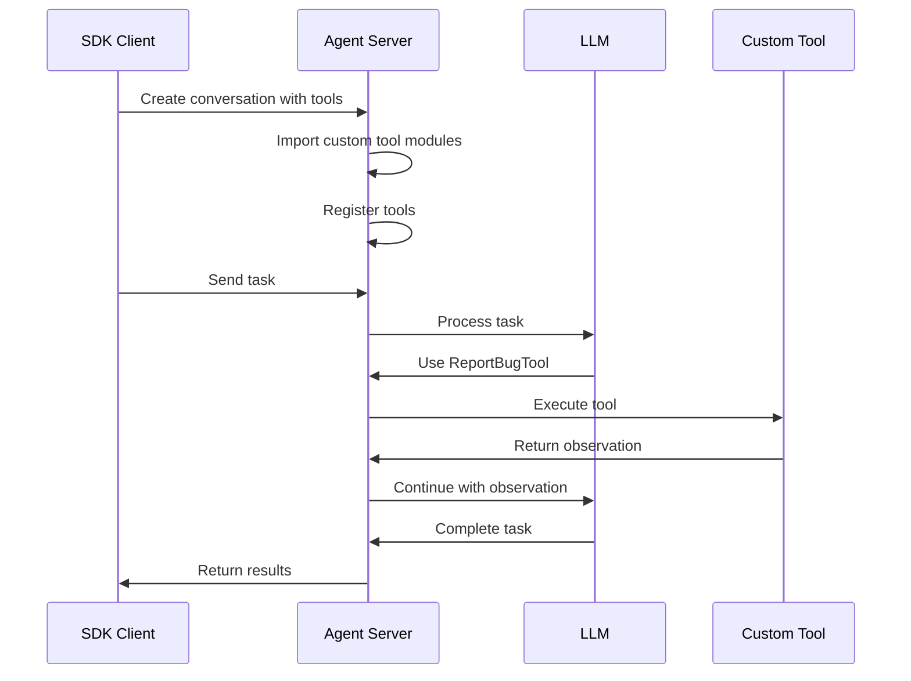

## Overview

When using a [remote agent server](/sdk/guides/agent-server/overview), custom tools must be available in the server's Python environment. This guide shows how to build and deploy a custom agent server image with your custom tools.

<Note>
For standalone custom tools (without remote agent server), see the [Custom Tools guide](/sdk/guides/custom-tools).
</Note>

## Use Cases

Custom tools with remote agent servers are useful for:

- **Structured data collection**: Define tools like `report_bug`, `log_metric`, or `record_event` to collect structured data during agent runs
- **Custom integrations**: Tools that interact with external systems (APIs, databases, etc.)
- **Domain-specific operations**: Business logic tools specific to your application
- **Downstream processing**: Collected data can be used to create Jira tickets, generate reports, trigger workflows, etc.

## Architecture

```
┌─────────────────┐         ┌──────────────────────────┐
│   SDK Client    │         │   Remote Agent Server    │
│                 │         │   (Custom Docker Image)  │
│  - Define tools │◄────────┤                          │
│  - Send tasks   │   API   │  - Custom tools in       │
│  - Get results  │         │    Python path           │
│                 │         │  - Dynamic registration  │
└─────────────────┘         │  - Tool execution        │
                            └──────────────────────────┘
```

## Complete Example

<Note>
A complete working example is available on GitHub: [examples/02_remote_agent_server/05_custom_tool/](https://github.com/OpenHands/software-agent-sdk/tree/main/examples/02_remote_agent_server/05_custom_tool)
</Note>

The example includes:
- **Custom tool implementation** (`report_bug.py`) - A tool for reporting bugs with structured data
- **Dockerfile** - Extends the base agent server image with custom tools
- **Build script** (`build_custom_image.sh`) - Builds the custom image
- **SDK example** (`custom_tool_example.py`) - Demonstrates the full workflow

## Step-by-Step Guide

### 1. Define Your Custom Tool

Create a Python module for your tool (e.g., `custom_tools/report_bug.py`):

```python
"""Custom tool for reporting bugs with structured data."""

from enum import Enum

from pydantic import Field

from openhands.sdk import Action, Observation, ToolDefinition
from openhands.sdk.tool import ToolExecutor, register_tool


class BugSeverity(str, Enum):
    """Bug severity levels."""
    LOW = "low"
    MEDIUM = "medium"
    HIGH = "high"
    CRITICAL = "critical"


class BugAction(Action):
    """Action for reporting a bug."""
    title: str = Field(description="Bug title")
    description: str = Field(description="Detailed bug description")
    severity: BugSeverity = Field(description="Bug severity level")
    steps_to_reproduce: list[str] = Field(
        default_factory=list,
        description="Steps to reproduce the bug"
    )
    expected_behavior: str | None = Field(
        default=None,
        description="Expected behavior"
    )
    actual_behavior: str | None = Field(
        default=None,
        description="Actual behavior"
    )
    affected_files: list[str] = Field(
        default_factory=list,
        description="Files affected by the bug"
    )
    tags: list[str] = Field(
        default_factory=list,
        description="Tags for categorization"
    )


class BugObservation(Observation):
    """Observation returned after reporting a bug."""
    bug_id: str = Field(description="Unique bug ID")
    success: bool = Field(description="Whether the bug was reported successfully")
    message: str = Field(description="Confirmation message")


class ReportBugExecutor(ToolExecutor[BugAction, BugObservation]):
    """Executor that handles bug reporting."""

    def __init__(self):
        super().__init__()
        self.bugs: list[BugAction] = []

    def __call__(self, action: BugAction, conversation=None):
        """Execute the bug report action."""
        # Store the bug
        self.bugs.append(action)
        bug_id = f"BUG-{len(self.bugs):04d}"
        
        # In production, you would:
        # - Store in database
        # - Create Jira ticket
        # - Send notification
        # - etc.
        
        return BugObservation(
            bug_id=bug_id,
            success=True,
            message=(
                f"Bug '{action.title}' reported successfully "
                f"with ID {bug_id} (severity: {action.severity.value})"
            )
        )


class ReportBugTool(ToolDefinition[BugAction, BugObservation]):
    """Tool for reporting bugs with structured data."""

    @classmethod
    def create(cls, conv_state, **params):
        executor = ReportBugExecutor()
        return [cls(
            description=(
                "Report a bug with structured information including title, "
                "description, severity, reproduction steps, and affected files. "
                "Use this tool to document bugs found during code analysis."
            ),
            action_type=BugAction,
            observation_type=BugObservation,
            executor=executor,
        )]


# Auto-register the tool when this module is imported
register_tool("ReportBugTool", ReportBugTool)
```

### 2. Create a Dockerfile

Create a `Dockerfile` that extends the base agent server image:

```dockerfile
# Dockerfile for custom agent server with custom tools
ARG BASE_IMAGE=ghcr.io/openhands/agent-server:latest-python
FROM ${BASE_IMAGE}

# Copy custom tools into the Python path
COPY custom_tools /app/custom_tools

# Add /app to PYTHONPATH so custom_tools can be imported
ENV PYTHONPATH="/app:${PYTHONPATH}"
```

### 3. Create a Build Script

Create a build script (`build_custom_image.sh`):

```bash
#!/bin/bash
set -e

TAG="${1:-custom-agent-server:latest}"
BASE_IMAGE="${BASE_IMAGE:-ghcr.io/openhands/agent-server:latest-python}"

echo "🐳 Building custom agent server image..."
echo "📦 Base image: $BASE_IMAGE"
echo "🏷️  Tag: $TAG"

docker build \
  -t "$TAG" \
  -f Dockerfile \
  --build-arg BASE_IMAGE="$BASE_IMAGE" \
  .

echo "✅ Custom agent server image built successfully!"
echo "🏷️  Image tag: $TAG"
```

Make it executable:
```bash
chmod +x build_custom_image.sh
```

### 4. Build the Custom Image

Build your custom agent server image:

```bash
./build_custom_image.sh my-custom-agent-server:latest
```

### 5. Use the Custom Image in Your SDK Script

Create an SDK script that uses the custom image:

```python
import os
from pathlib import Path
from pydantic import SecretStr

from openhands.sdk import (
    LLM,
    Agent,
    Conversation,
    Tool,
)
from openhands.tools.preset.default import get_default_tools, get_default_condenser
from openhands.workspace import DockerWorkspace

# Set up LLM
api_key = os.getenv("LLM_API_KEY")
llm = LLM(
    usage_id="agent",
    model="anthropic/claude-sonnet-4-5-20250929",
    api_key=SecretStr(api_key),
)

# Create workspace with custom image
with DockerWorkspace(
    server_image="my-custom-agent-server:latest",
    host_port=8010,
) as workspace:
    # Create agent with custom tools
    tools = get_default_tools(enable_browser=False)
    tools.append(Tool(name="ReportBugTool"))  # Add custom tool
    
    agent = Agent(
        llm=llm,
        tools=tools,
        system_prompt_kwargs={"cli_mode": True},
        condenser=get_default_condenser(
            llm=llm.model_copy(update={"usage_id": "condenser"})
        ),
    )
    
    # Create conversation
    conversation = Conversation(
        agent=agent,
        workspace=workspace,
    )
    
    # Send task that uses the custom tool
    conversation.send_message(
        "Please analyze the code and use ReportBugTool to report any bugs you find."
    )
    conversation.run()
```

## How It Works

### Dynamic Tool Registration

When you create a conversation with custom tools:

1. **Client collects tool names**: The SDK gathers tool module qualnames from your tool registry
2. **Server receives tool list**: These qualnames are sent to the server in the conversation creation request
3. **Server imports modules**: The server imports the tool modules, triggering `register_tool()` calls
4. **Tools become available**: The agent can now use your custom tools during execution

### Tool Execution Flow



## Production Deployment

### Building for Production

1. **Build and tag**:
   ```bash
   docker build -t my-registry/agent-server:1.0.0 .
   ```

2. **Push to registry**:
   ```bash
   docker push my-registry/agent-server:1.0.0
   ```

3. **Use in production**:
   ```python
   with DockerWorkspace(
       server_image="my-registry/agent-server:1.0.0",
       host_port=8010,
   ) as workspace:
       # Your code
   ```

### Tool Package Structure

For larger projects, structure your tools as a Python package:

```
my_custom_tools/
├── __init__.py
├── pyproject.toml
├── my_tools/
│   ├── __init__.py
│   ├── bug_reporter.py
│   ├── metric_logger.py
│   └── event_recorder.py
└── Dockerfile
```

Install in the Dockerfile:
```dockerfile
COPY my_custom_tools /app/my_custom_tools
RUN pip install /app/my_custom_tools
```

### Data Persistence

For production data collection:

- **Database storage**: Have tools write to a database
- **Export via API**: Add endpoints to export collected data
- **Volume mounting**: Mount volumes to persist data outside the container
- **Event streaming**: Use the SDK event system to stream data to your application

## Best Practices

### Tool Design

1. **Clear interfaces**: Define clear Action and Observation types with descriptive fields
2. **Validation**: Use Pydantic validators to ensure input validity
3. **Error handling**: Return meaningful errors in observations
4. **Documentation**: Include detailed descriptions for LLM understanding

### Image Management

1. **Version tags**: Use semantic versioning for your images
2. **Base image updates**: Regularly update to latest base images
3. **Security scanning**: Scan images for vulnerabilities
4. **Size optimization**: Keep images small by removing unnecessary dependencies

### Testing

1. **Unit tests**: Test tool executors independently
2. **Integration tests**: Test with actual agent conversations
3. **Mock external services**: Use mocks for external APIs during testing
4. **Validation**: Verify tool registration and imports

## Troubleshooting

### Tool Not Found

If you get "Tool 'MyTool' is not registered":
- Ensure `register_tool()` is called at module level (not in a function)
- Check that the module is in `PYTHONPATH`
- Verify the Dockerfile copies your tools correctly
- Check that the tool name matches exactly

### Import Errors

If imports fail on the server:
- Check `PYTHONPATH` in the Dockerfile
- Ensure all dependencies are installed in the image
- Use absolute imports in your tool modules
- Verify Python version compatibility

### Build Failures

If Docker build fails:
- Check that base image is accessible
- Verify file paths in `COPY` commands
- Ensure base image has Python 3.12+
- Check Docker build context

## Example Use Case: Bug Reporting Bot

Here's a real-world example of using custom tools for automated bug reporting:

```python
# 1. Define the tool (as shown above)
# 2. Build custom image
# 3. Use in SDK:

with DockerWorkspace(server_image="bug-reporter:latest", host_port=8010) as workspace:
    agent = Agent(llm=llm, tools=[Tool(name="ReportBugTool")])
    conversation = Conversation(agent=agent, workspace=workspace)
    
    # Analyze a codebase
    conversation.send_message(
        "Analyze the Python files in /app/src and report all bugs using ReportBugTool. "
        "For each bug, include severity, reproduction steps, and affected files."
    )
    conversation.run()
    
    # Access collected bugs via tool executor
    # (You'd need to add an API endpoint or database query)
    print("Bugs reported successfully!")
```

## Next Steps

- Review the [complete example on GitHub](https://github.com/OpenHands/software-agent-sdk/tree/main/examples/02_remote_agent_server/05_custom_tool)
- Learn about [custom tools in standalone mode](/sdk/guides/custom-tools)
- Explore [agent server architecture](/sdk/guides/agent-server/overview)
- Check out [Docker sandbox configuration](/sdk/guides/agent-server/docker-sandbox)

## Related Guides

- [Custom Tools (Standalone)](/sdk/guides/custom-tools)
- [Agent Server Overview](/sdk/guides/agent-server/overview)
- [Docker Sandbox](/sdk/guides/agent-server/docker-sandbox)
- [Local Server](/sdk/guides/agent-server/local-server)
