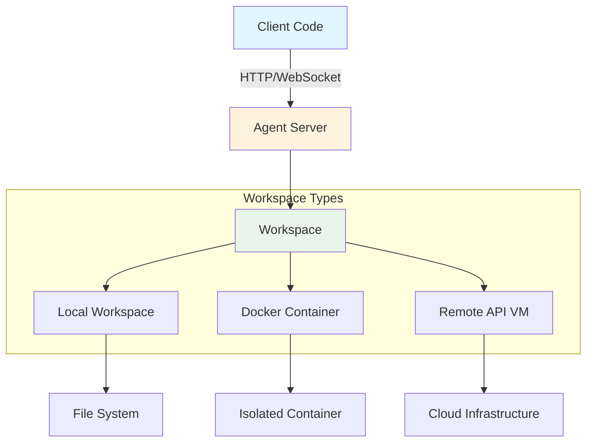

The Agent SDK supports both standalone and client-server architectures. Remote Agent Servers enable you to run agents on dedicated infrastructure while keeping client code separate, providing isolation, scalability, and centralized management.

## What is a Remote Agent Server?

A Remote Agent Server is an HTTP/WebSocket server that:
- **Runs agents** on dedicated infrastructure
- **Manages workspaces** (Docker containers or remote VMs)
- **Streams events** to clients via WebSocket
- **Handles file operations** (upload, download, editing)
- **Provides isolation** between different agent executions

Think of it as the "backend" for your agent, while your Python code acts as the "frontend" client.

## Architecture Overview



## How Remote Conversations Work

### 1. Workspace Connection

When you create a `Conversation` with a remote workspace, it automatically becomes a `RemoteConversation`:

```python
from openhands.sdk import Conversation
from openhands.workspace import DockerWorkspace

with DockerWorkspace(server_image="ghcr.io/openhands/agent-server:latest") as workspace:
    # Conversation automatically detects remote workspace
    conversation = Conversation(agent=agent, workspace=workspace)
    # conversation is now a RemoteConversation
```

### 2. Agent Server Initialization

The workspace (DockerWorkspace or APIRemoteWorkspace) automatically:
- Starts an agent server in the workspace
- Waits for the server to be ready
- Provides the server URL to the conversation

### 3. Event Streaming

The RemoteConversation establishes a WebSocket connection to stream events:

```python
def event_callback(event):
    print(f"Received: {type(event).__name__}")

conversation = Conversation(
    agent=agent,
    workspace=workspace,
    callbacks=[event_callback]  # Callbacks receive real-time events
)
```

Events flow:
1. Client sends message via HTTP
2. Agent server executes agent logic
3. Events stream back via WebSocket
4. Client callbacks receive events in real-time

### 4. File Operations

File operations go through the agent server API:

```python
# Upload files to workspace
workspace.upload_file(local_path, remote_path)

# Download files from workspace
workspace.download_file(remote_path, local_path)

# Execute commands
result = workspace.execute_command("ls -la")
print(result.stdout)
```

## Workspace Types

The SDK provides three workspace types for different use cases:

### Local Workspace (Development)

- **Description**: Direct execution on your machine
- **Setup**: None (default)
- **Use Case**: Quick development and testing
- **Security**: ⚠️ Low - full host access

```python
from openhands.sdk import Conversation

# Local workspace is implicit
conversation = Conversation(agent=agent)
# Runs directly on your machine
```

### Docker Workspace (Self-Hosted)

- **Description**: Isolated Docker containers
- **Setup**: Docker required
- **Use Case**: Production, testing, multi-tenant
- **Security**: ✅ High - complete isolation

```python
from openhands.workspace import DockerWorkspace

with DockerWorkspace(
    server_image="ghcr.io/openhands/agent-server:latest-python"
) as workspace:
    conversation = Conversation(agent=agent, workspace=workspace)
    # Runs in isolated Docker container
```

### API Remote Workspace (Managed)

- **Description**: Hosted runtime API service
- **Setup**: API key only
- **Use Case**: Zero-ops production
- **Security**: ✅ High - managed isolation

```python
from openhands.workspace import APIRemoteWorkspace

with APIRemoteWorkspace(
    runtime_api_url="https://runtime.example.com",
    runtime_api_key="your-key"
) as workspace:
    conversation = Conversation(agent=agent, workspace=workspace)
    # Runs on managed infrastructure
```

## Comparison Table

| Feature | Local | Docker | API Remote |
|---------|-------|--------|------------|
| **Setup** | None | Docker | API key |
| **Isolation** | None | High | High |
| **Infrastructure** | Local | Self-managed | Managed |
| **Scalability** | N/A | Manual | Automatic |
| **Cost** | Free | Infrastructure | Usage-based |
| **Best For** | Development | Control & Testing | Production |

## When to Use Remote Agent Servers

### Use Remote Servers When You Need:

**Isolation**
- Protect host system from agent actions
- Run untrusted or experimental code safely
- Separate different agent workloads

**Scalability**
- Handle multiple concurrent users
- Auto-scale based on demand
- Distribute workload across servers

**Production Deployment**
- Centralized agent management
- Monitoring and logging
- Resource control and limits

**Team Collaboration**
- Multiple developers sharing infrastructure
- Consistent development environments
- Centralized configuration

### Use Local Workspace When:

- Rapid development iteration
- Direct access to local files needed
- No isolation requirements
- Single-user development

## Getting Started

### Quick Start: Local Agent Server

Test remote conversation features locally:

```python
from openhands.sdk import Workspace, Conversation

# Start local agent server
workspace = Workspace(host="http://localhost:8000")

conversation = Conversation(agent=agent, workspace=workspace)
conversation.send_message("Hello!")
conversation.run()
```

See: [Local Agent Server](/sdk/guides/agent-server/local-agent-server)

### Production: Docker Sandboxed Server

Run agents in isolated Docker containers:

```python
from openhands.workspace import DockerWorkspace

with DockerWorkspace(
    server_image="ghcr.io/openhands/agent-server:latest-python"
) as workspace:
    conversation = Conversation(agent=agent, workspace=workspace)
    conversation.send_message("Deploy my application")
    conversation.run()
```

See: [Docker Sandboxed Server](/sdk/guides/agent-server/docker-sandboxed-server)

### Zero-Ops: API Sandboxed Server

Use managed infrastructure:

```python
from openhands.workspace import APIRemoteWorkspace

with APIRemoteWorkspace(
    runtime_api_url="https://runtime.example.com",
    runtime_api_key="your-key"
) as workspace:
    conversation = Conversation(agent=agent, workspace=workspace)
    conversation.send_message("Analyze this codebase")
    conversation.run()
```

See: [API Sandboxed Server](/sdk/guides/agent-server/api-sandboxed-server)

## Advanced Features

### Browser Automation

Enable browser tools in Docker:

```python
from openhands.workspace import DockerWorkspace

with DockerWorkspace(
    base_image="nikolaik/python-nodejs:python3.12-nodejs22",
    extra_ports=True  # Enables VNC access
) as workspace:
    agent = get_default_agent(llm=llm, cli_mode=False)  # Browser enabled
    conversation = Conversation(agent=agent, workspace=workspace)
```

See: [Browser with Docker](/sdk/guides/agent-server/browser-with-docker)

### VS Code Integration

Access VS Code Web in container:

```python
with DockerWorkspace(
    base_image="nikolaik/python-nodejs:python3.12-nodejs22",
    extra_ports=True  # Enables VS Code Web
) as workspace:
    # VS Code available at http://localhost:8011
    conversation = Conversation(agent=agent, workspace=workspace)
```

See: [VS Code with Docker](/sdk/guides/agent-server/vscode-with-docker)

## Security Considerations

### Docker Isolation

Docker workspaces provide:
- **Process isolation**: Agent cannot affect host processes
- **File system isolation**: Agent cannot access host files
- **Network isolation**: Controlled network access
- **Resource limits**: CPU/memory constraints

### Best Practices

1. **Use Pre-built Images**: Faster startup, verified content
2. **Set Resource Limits**: Prevent resource exhaustion
3. **Enable Authentication**: Protect server endpoints
4. **Monitor Activity**: Log and audit agent actions
5. **Update Regularly**: Keep server images current

## Next Steps

Explore different deployment options:

- **[Local Agent Server](/sdk/guides/agent-server/local-agent-server)** - Development setup
- **[Docker Sandboxed Server](/sdk/guides/agent-server/docker-sandboxed-server)** - Self-hosted production
- **[API Sandboxed Server](/sdk/guides/agent-server/api-sandboxed-server)** - Managed hosting
- **[Browser with Docker](/sdk/guides/agent-server/browser-with-docker)** - Web automation
- **[VS Code with Docker](/sdk/guides/agent-server/vscode-with-docker)** - Code editing

For architectural details:
- **[Agent Server Architecture](/sdk/arch/agent_server/overview)** - Technical deep dive
- **[Workspace Architecture](/sdk/arch/sdk/workspace)** - Workspace internals