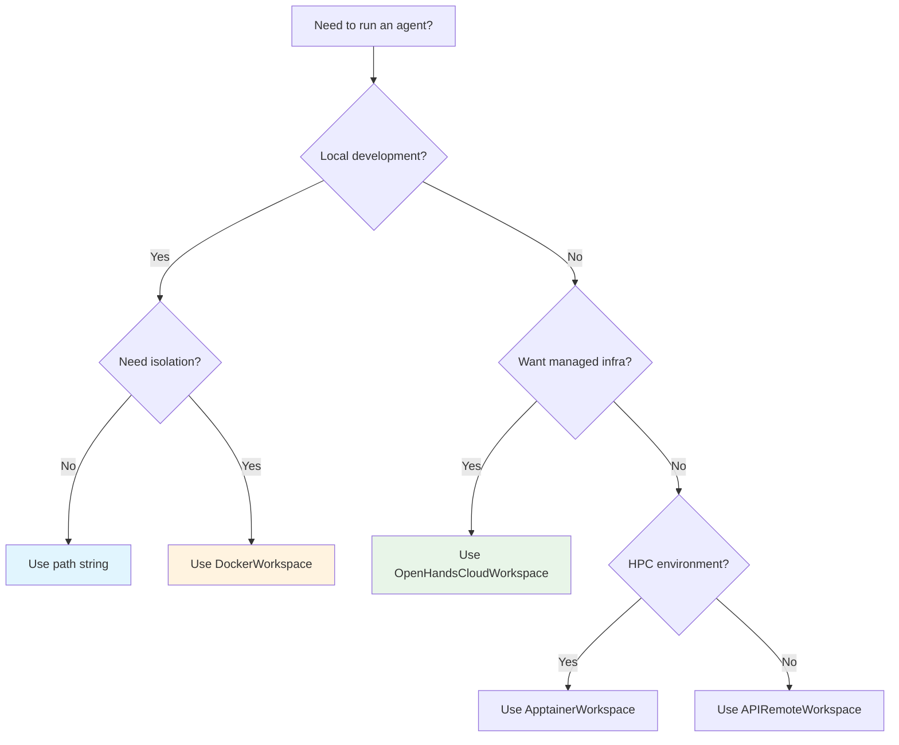

The SDK supports multiple workspace types, each suited to different deployment scenarios. All workspaces share the same API — switching between them requires only changing the workspace argument to `Conversation`.

## Quick Comparison

| Workspace | Best For | Infrastructure | Isolation | SaaS<br/>Auth |
|-----------|----------|----------------|:---------:|:-------------:|
| [LocalWorkspace](/sdk/guides/agent-server/local-server) | Development, testing | None | ❌ | ❌ |
| [DockerWorkspace](/sdk/guides/agent-server/docker-sandbox) | Local isolation, CI/CD | Local Docker | ✅ | ❌ |
| [ApptainerWorkspace](/sdk/guides/agent-server/apptainer-sandbox) | HPC, shared compute | Singularity | ✅ | ❌ |
| [APIRemoteWorkspace](/sdk/guides/agent-server/api-sandbox) | Self-managed infra | Runtime API | ✅ | ❌ |
| [OpenHandsCloudWorkspace](/sdk/guides/agent-server/cloud-workspace) | Production, managed | OpenHands Cloud | ✅ | ✅ |

## Decision Guide



### Use a Path String or `LocalWorkspace` When...
- You're developing and testing locally
- You don't need isolation between agent and host
- You want the fastest startup time

```python
conversation = Conversation(agent=agent, workspace="./my-project")
```

### Use `DockerWorkspace` When...
- You need isolation on your local machine
- You're running in CI/CD pipelines
- You want reproducible environments

```python
from openhands.workspace import DockerWorkspace

with DockerWorkspace(
    server_image="ghcr.io/openhands/agent-server:latest-python",
) as workspace:
    conversation = Conversation(agent=agent, workspace=workspace)
```

### Use `OpenHandsCloudWorkspace` When...
- You want fully managed infrastructure
- You need to inherit LLM config and secrets from your OpenHands Cloud account
- You're building production applications

```python
from openhands.workspace import OpenHandsCloudWorkspace

with OpenHandsCloudWorkspace(
    cloud_api_url="https://app.all-hands.dev",
    cloud_api_key=os.environ["OPENHANDS_CLOUD_API_KEY"],
) as workspace:
    llm = workspace.get_llm()  # Inherit from your SaaS account
    secrets = workspace.get_secrets()
    conversation = Conversation(agent=agent, workspace=workspace)
```

### Use `APIRemoteWorkspace` When...
- You have access to a Runtime API deployment
- You want to manage your own infrastructure
- You need specific container images or resource configurations

```python
from openhands.workspace import APIRemoteWorkspace

with APIRemoteWorkspace(
    runtime_api_url="https://runtime.example.com",
    runtime_api_key=os.environ["RUNTIME_API_KEY"],
    server_image="ghcr.io/openhands/agent-server:latest-python",
) as workspace:
    conversation = Conversation(agent=agent, workspace=workspace)
```

### Use `ApptainerWorkspace` When...
- You're running on HPC clusters or shared compute environments
- Your infrastructure uses Singularity/Apptainer instead of Docker
- You need rootless container execution

```python
from openhands.workspace import ApptainerWorkspace

with ApptainerWorkspace(
    server_image="ghcr.io/openhands/agent-server:latest-python",
) as workspace:
    conversation = Conversation(agent=agent, workspace=workspace)
```

## How Workspaces Relate to Conversations

The `Conversation` factory automatically selects the appropriate implementation based on your workspace:

| Workspace Type | Conversation Type | Where Agent Runs |
|----------------|-------------------|------------------|
| Path / `LocalWorkspace` | `LocalConversation` | Your Python process |
| Any `RemoteWorkspace` | `RemoteConversation` | On the agent server |

You don't need to specify the conversation type — it's chosen automatically:

```python
# LocalConversation (agent runs in your process)
conversation = Conversation(agent=agent, workspace="./project")

# RemoteConversation (agent runs on agent server)
with DockerWorkspace(...) as workspace:
    conversation = Conversation(agent=agent, workspace=workspace)
```

## Feature Comparison

| Feature | Local | Docker | Cloud | API | Apptainer |
|---------|-------|--------|-------|-----|-----------|
| No setup required | ✅ | Docker needed | ✅ | Runtime API access | Apptainer needed |
| File isolation | ❌ | ✅ | ✅ | ✅ | ✅ |
| Network isolation | ❌ | ✅ | ✅ | ✅ | ✅ |
| `get_llm()` | ❌ | ❌ | ✅ | ❌ | ❌ |
| `get_secrets()` | ❌ | ❌ | ✅ | ❌ | ❌ |
| Pause/Resume | ❌ | ❌ | ❌ | ✅ | ❌ |
| Custom images | N/A | ✅ | Via specs | ✅ | ✅ |

## Next Steps

- **[Local Server](/sdk/guides/agent-server/local-server)** — Run without isolation
- **[Docker Sandbox](/sdk/guides/agent-server/docker-sandbox)** — Local Docker containers
- **[Cloud Workspace](/sdk/guides/agent-server/cloud-workspace)** — OpenHands Cloud managed service
- **[API Sandbox](/sdk/guides/agent-server/api-sandbox)** — Self-managed Runtime API
- **[Apptainer Sandbox](/sdk/guides/agent-server/apptainer-sandbox)** — HPC environments
