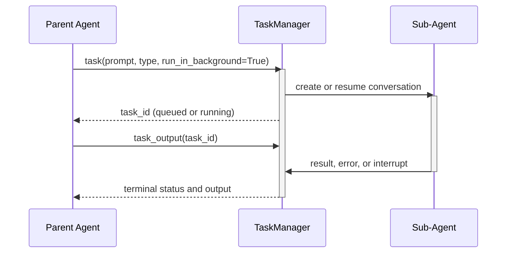

import RunExampleCode from "/sdk/shared-snippets/how-to-run-example.mdx";

> A ready-to-run example is available [here](#ready-to-run-example).

## Overview

The `TaskToolSet` lets a parent agent launch sub-agents that handle complex,
multi-step tasks autonomously. Blocking execution remains the default: the
parent waits for the sub-agent and receives its result. A task can instead opt
into process-local background execution, which returns a stable task ID
immediately. The parent can then poll or wait for output and request
cooperative cancellation through the companion lifecycle tools.

This pattern is useful when:

- Delegating specialized work to purpose-built sub-agents
- Running independent background tasks while the parent continues
- Maintaining conversational context across multiple interactions with a sub-agent
- Isolating sub-task complexity from the parent agent's context

<Tip>
Use the default blocking mode when the parent needs the result before
continuing. Set `run_in_background=True` only when the parent can continue
useful work while the sub-agent runs.
</Tip>

## Background Tasks

`TaskToolSet` registers three related tools that share one task manager:
`task`, `task_output`, and `task_stop`. The latter two are used for tasks
started with `run_in_background=True`; blocking calls continue to use the same
`task` tool and existing resume behavior.

Set `run_in_background=True` on a `TaskAction`. The launch observation returns
one stable `task_id`. Use `TaskOutputAction` to inspect the current state or
wait for a terminal result, and use `TaskStopAction` to request cooperative
cancellation.

```python icon="python"
from openhands.tools.task import (
    TaskAction,
    TaskOutputAction,
    TaskStopAction,
    TaskToolSet,
)

# `conversation` is an existing LocalConversation with TaskToolSet enabled.
task_tools = TaskToolSet.create(conv_state=conversation.state)
task_executor = task_tools[0].executor

started = task_executor(
    TaskAction(
        prompt="Review the authentication changes.",
        subagent_type="code_reviewer",
        run_in_background=True,
    ),
    conversation,
)
task_id = started.task_id

status = task_executor(TaskOutputAction(task_id=task_id), conversation)
if status.status == "completed":
    print(status.text)
elif status.status in {"queued", "running"}:
    task_executor(TaskStopAction(task_id=task_id), conversation)
```

Background tasks move through `queued`, `running`, `completed`, `error`, or
`cancelled`. Multiple tasks can run at the same time. A second resume of the
same active task is rejected until the first task reaches a settled terminal
state. Repeated output reads are read-only, repeated stop requests are
idempotent for cancelled tasks, and neither operation duplicates usage metrics.

<Warning>
Background task IDs are process-local control handles owned by one task manager
and parent conversation. The registry is not restored after a process restart.
Persisted sub-agent conversation files may remain, but the current task API
reports the old ID as unknown because it does not restore workers or handles.
</Warning>

## How It Works

The parent calls `task` with a prompt and a sub-agent type. The `TaskManager`
creates (or resumes) a sub-agent conversation. In blocking mode, the call
waits for the final response. In background mode, the call publishes a task and
returns while one managed worker uses `LocalConversation.arun()` and settles
output, errors, metrics, and cleanup exactly once.



### Task Lifecycle

1. **Creation**: A fresh sub-agent conversation is created and assigned a task ID
2. **Queued / running**: Background mode returns while the worker runs asynchronously
3. **Completion**: The final response, error, or cancellation state is settled once
4. **Cleanup**: Metrics are recorded once and the sub-agent conversation is closed
5. **Resumption** (optional): A settled task can be resumed explicitly with its context preserved

## Setting Up the TaskToolSet

<Steps>
    <Step>
        ### Register Custom Sub-Agent Types (Optional)

        The built-in `general-purpose` agent is available by default. You can
        register custom types for specialized behavior:

        ```python icon="python"
        from openhands.sdk import Agent, AgentContext, LLM
        from openhands.sdk.context import Skill
        from openhands.sdk.subagent import register_agent

        def create_code_reviewer(llm: LLM) -> Agent:
            return Agent(
                llm=llm,
                tools=[],
                agent_context=AgentContext(
                    skills=[
                        Skill(
                            name="code_review",
                            content="Review code for correctness and regressions.",
                            trigger=None,
                        )
                    ],
                ),
            )

        register_agent(
            name="code_reviewer",
            factory_func=create_code_reviewer,
            description="Reviews code for bugs and regressions.",
        )
        ```
    </Step>
    <Step>
        ### Add TaskToolSet to the Agent

        ```python icon="python"
        from openhands.sdk import Agent, Tool
        from openhands.tools.task import TaskToolSet

        agent = Agent(
            llm=llm,
            tools=[Tool(name=TaskToolSet.name)],
        )
        ```

        The tool set is registered on import; no explicit `register_tool()`
        call is needed. Resolving `TaskToolSet` creates `task`, `task_output`,
        and `task_stop` with one shared executor.
    </Step>
    <Step>
        ### Create a Conversation

        ```python icon="python"
        from pathlib import Path

        from openhands.sdk import Conversation
        from openhands.tools.delegate import DelegationVisualizer

        conversation = Conversation(
            agent=agent,
            workspace=Path.cwd(),
            visualizer=DelegationVisualizer(name="Orchestrator"),
        )
        ```

        The visualizer is optional; when provided, it shows the parent and
        sub-agent conversation flow.
    </Step>
</Steps>

## Tool Parameters

| Parameter | Type | Required | Description |
|-----------|------|----------|-------------|
| `prompt` | `str` | Yes | The instruction for the sub-agent |
| `subagent_type` | `str` | No | Registered agent type; the legacy default name is `"default"` and resolves to `general-purpose` |
| `description` | `str` | No | Short label for display and tracking |
| `resume` | `str` | No | Settled task ID to continue |
| `run_in_background` | `bool` | No | Return a task ID immediately; defaults to `False` |

For `task_output`, `block=True` waits for a terminal state, timeout, or a
stop/manager-close signal so a reader is not stranded during cooperative
cleanup. Its `timeout` must be between `0` and `3600` seconds and must be
finite. `task_stop` requests cooperative cancellation through the child
`LocalConversation`; it never force-kills a Python thread.

## Task Observation

The task tools return observations containing:

| Field | Description |
|-------|-------------|
| `task_id` | Stable identifier returned by `task` |
| `subagent` | Agent type assigned to the task |
| `status` | `queued`, `running`, `completed`, `error`, or `cancelled` |
| `text` | Response, partial cancellation output, or error message |

Unknown task IDs and invalid lifecycle operations return an error observation
without changing another task. Reading status or output repeatedly is safe and
does not duplicate usage accounting.

## Resuming Tasks

Within the same manager lifetime, a settled task's conversation is persisted to
disk. Passing its `task_id` as `resume` reloads the full conversation history,
allowing the sub-agent to continue where it left off. Resuming while a task is
queued, running, or still settling is rejected. A process restart does not
restore the in-memory task registry or running workers, so the current task API
reports the old ID as unknown even when conversation files remain.

```python icon="python"
conversation.send_message(
    "Use the task tool with resume='task_00000001' to verify the previous result."
)
conversation.run()
```

## Ready-to-run Example

<Note>
This example is available on GitHub:
[examples/01_standalone_sdk/41_task_tool_set.py](https://github.com/OpenHands/software-agent-sdk/blob/main/examples/01_standalone_sdk/41_task_tool_set.py)
</Note>

<RunExampleCode path_to_script="examples/01_standalone_sdk/41_task_tool_set.py"/>

## Next Steps

- **[Custom Tools](/sdk/guides/custom-tools)** - Build your own tools
- **[Skills](/sdk/guides/skill)** - Configure agent behavior with skills
