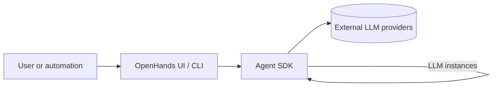

The Agent SDK owns all language model (LLM) orchestration in OpenHands **v1**. The
standalone OpenHands repository now focuses on user interfaces (web app, CLI,
cloud) that talk to the SDK. This page explains how LLMs fit into that new
architecture and shows the core APIs you will use when building your own
interfaces or automations.

## Architecture overview

- **Agent SDK = source of truth.** The SDK defines the `LLM` model, request
  pipeline, retries, telemetry, and registry.
- **Interfaces reuse the same LLM objects.** The OpenHands UI or CLI simply
  hydrate an SDK `LLM` from persisted settings and pass it to an agent.
- **Consistent configuration.** Whether you launch an agent programmatically or
  via the OpenHands UI, the supported parameters and defaults come from the SDK.



## Creating LLM instances

Use the [`openhands.sdk.llm.LLM`](https://github.com/All-Hands-AI/agent-sdk/blob/main/openhands-sdk/openhands/sdk/llm/llm.py)
class to configure model access. The only required field is the `model` name;
other options (API keys, retry tuning, response tracing) are optional.

```python
from pydantic import SecretStr
from openhands.sdk import LLM

llm = LLM(
    model="anthropic/claude-sonnet-4.1",
    api_key=SecretStr("sk-ant-123"),
    service_id="primary",
    temperature=0.1,
    timeout=120,
)
```

Key concepts:

- **`service_id`** identifies an LLM configuration when storing it in a registry
  or persisting it between runs.
- **Retry settings** (`num_retries`, `retry_min_wait`, etc.) apply uniformly to
  all providers through LiteLLM.
- **Cost metadata** (`input_cost_per_token`, `output_cost_per_token`) feeds into
  SDK telemetry and logs for downstream UIs.

## Loading configuration from environments or files

Use helper constructors when you need to rehydrate an LLM from configuration
state:

```python
llm = LLM.load_from_env(prefix="LLM_")
```

This reads environment variables such as `LLM_MODEL`, `LLM_API_KEY`, or
`LLM_TIMEOUT` and casts them into the appropriate types. Interfaces like the
OpenHands UI persist settings using this convention so that the SDK can read them
without additional glue code. For JSON based workflows the SDK also exposes
`LLM.load_from_json("config/llm.json")`.

Learn more about configuration options in [LLM configuration details](./configuration).

## Managing multiple LLMs

When an application needs several LLM profiles (for example, a high-quality
model for coding and a cheaper summarizer) use the
[`LLMRegistry`](https://github.com/All-Hands-AI/agent-sdk/blob/main/openhands-sdk/openhands/sdk/llm/llm_registry.py):

```python
from openhands.sdk.llm import LLM, LLMRegistry

registry = LLMRegistry()
registry.add(LLM(model="anthropic/claude-sonnet-4.1", service_id="primary"))
registry.add(LLM(model="openai/gpt-4o-mini", service_id="summaries"))

code_llm = registry.get("primary")
summarizer = registry.get("summaries")
```

Registries ensure that agents launched by different parts of your application
reuse the same configuration objects, making retries and telemetry consistent.

## Relationship with OpenHands interfaces

The OpenHands repository (UI/CLI) now consumes these SDK APIs. When you adjust
LLM settings in the interfaces they are persisted and reloaded into SDK `LLM`
objects before each run, so any customization documented here carries over to
those application experiences.

Provider-specific guidance—pricing summaries, required parameters, or proxy
setups—remains valid and lives alongside the existing OpenHands documentation.
See [LLM provider guides](./providers) for links to those pages.
